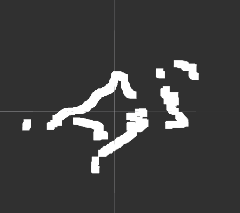

# Driver ROS 2 para MS200 / Oradar

# **Driver Nativo de ROS 2 Jazzy para LiDAR MS200 con Filtrado Anti-Oscilación**
 

 
## Descripción General

Este paquete proporciona un driver nativo de ROS 2 para el sensor LiDAR TOF MS200 (también conocido como Oradar MS200 o MKS MS200). Está desarrollado íntegramente en Python, implementando el protocolo de comunicación serial de bajo nivel para decodificar los paquetes de datos y publicar mensajes estándar `sensor_msgs/LaserScan`.

A diferencia de los scripts básicos, este driver incorpora un **procesamiento de señal avanzado**, incluyendo un filtro temporal de Media Móvil Exponencial (EMA) y discretización espacial. Esto elimina el ruido estático y la "oscilación" de los rayos, entregando escaneos estables y limpios que son ideales para algoritmos de mapeo y navegación (como Nav2 y SLAM Toolbox). Todo esto manteniendo un diseño ligero y sin dependencias de SDKs propietarios cerrados.
 
## Características

* **Implementación Nativa:** Escrito en Python utilizando la librería `pyserial`.
* **Soporte de Protocolo:** Detecta automáticamente el encabezado de trama estándar `54 2C`.
* **Filtro Anti-Oscilación (EMA):** Suaviza las lecturas en el tiempo mezclando datos crudos con el historial de escaneos, reduciendo drásticamente el ruido del sensor.
* **Discretización y Rellenado (Gap-filling):** Mapea los puntos crudos a exactamente 360 grados fijos e interpola lecturas faltantes, garantizando un arreglo `ranges` perfecto en cada rotación.
* **Compatibilidad:** Probado en Raspberry Pi 5 con ROS 2 Jazzy.
* **Salida Estándar:** Publica en el tópico `/scan`, listo para integrarse con el ecosistema de ROS 2.

## Requisitos de Hardware
* **Sensor:** MKS MS200 / Oradar MS200 TOF LiDAR.
* **Interfaz:** Adaptador USB a Serial (ej. CP2102, CH340).
* **Plataforma:** Sistema basado en Linux (Raspberry Pi, x86_64) con ROS 2 instalado.

## Instalación

1. Clonar el repositorio en el espacio de trabajo:
   ```bash
   cd ~/ros2_ws/src
   git clone [https://github.com/jasonmm24/ms200_driver.git](https://github.com/jasonmm24/ms200_driver.git)
   ```

2. Instalar dependencias:
   ```bash
   cd ~/ros2_ws
   rosdep install --from-paths src --ignore-src -r -y
   ```

3. Compilar el paquete:
   ```bash
   colcon build --symlink-install --packages-select ms200_driver
   source install/setup.bash
   ```

## Configuración

Asegúrese de que el usuario tenga permisos para acceder al puerto serial. Puede establecer permisos temporales con:

```bash
sudo chmod 777 /dev/ttyUSB0
```

Para acceso permanente, agregue su usuario al grupo `dialout`:

```bash
sudo usermod -a -G dialout $USER
```
*(Se requiere reiniciar el sistema o cerrar sesión para que este cambio surta efecto).*

## Uso

### Ejecución del Nodo

Para iniciar el driver con la configuración predeterminada:
```bash
ros2 run ms200_driver ms200_node
```

### Ejecución con Parámetros Personalizados

Puede modificar el puerto serial, la velocidad o el marco de referencia (frame_id) en tiempo de ejecución:
```bash
ros2 run ms200_driver ms200_node --ros-args -p port:=/dev/ttyUSB1 -p baudrate:=115200 -p frame_id:=base_laser
```

### Visualización en RViz2

1. Iniciar RViz2: `rviz2`
2. Establecer **Fixed Frame** en: `laser_frame` (o el que haya configurado).
3. Agregar el tópico: `/scan`
4. *(Opcional)* Incrementar el valor de *Decay Time* en la visualización del LaserScan para apreciar la estabilidad del filtro de suavizado.

## Parámetros

| Parámetro | Tipo | Predeterminado | Descripción |
| :--- | :--- | :--- | :--- |
| `port` | string | `/dev/ttyUSB0` | El puerto serial donde está conectado el LiDAR. |
| `baudrate` | int | `230400` | Velocidad de comunicación serial (Baud rate). |
| `frame_id` | string | `laser_frame` | El ID del marco TF asociado al mensaje LaserScan. |

## Tópicos Publicados

* `/scan` (`sensor_msgs/msg/LaserScan`): Datos del escaneo láser 2D procesados y suavizados.

## Autor

**Jonathan Jason Medina Martinez**
* Organización: **OPEN SOURCE - UPIITA - C-ROS**
* Email: jason240208@gmail.com

## Licencia

Este proyecto está bajo la Licencia **MIT**.